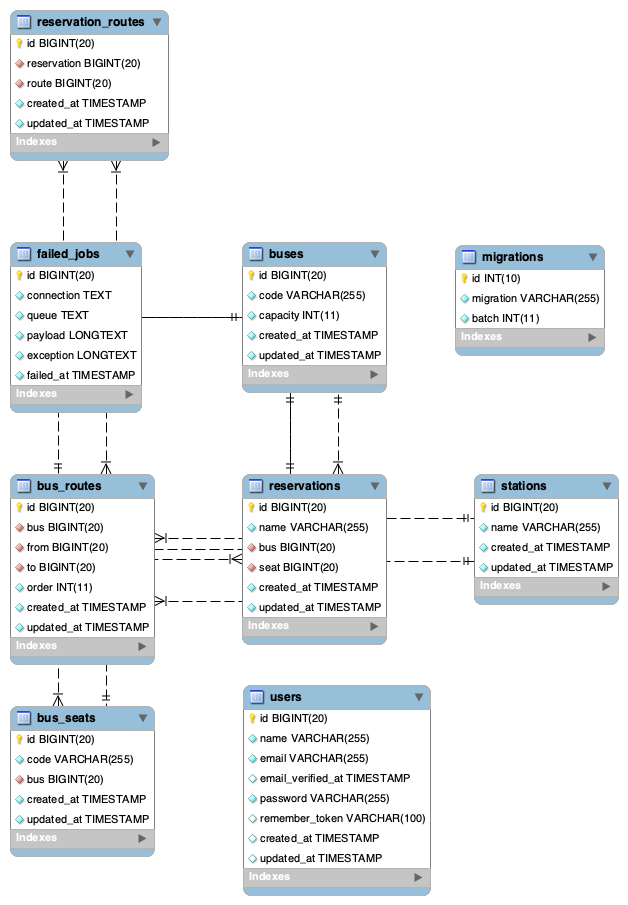

## Bus Booking App Demo

## Database ER:


## Local Development Server

If you have PHP installed locally and you would like to use PHP's built-in development server to serve your application, you may use the serve Artisan command. This command will start a development server at http://localhost:8000:

```bash
$ php artisan serve
$ php artisan migrate:fresh --seed
```

##Using Docker Containers
```bash
$ docker-compose up -d --build
```

## API Docs
The latest documentation is available [here](https://documenter.getpostman.com/view/5026193/SzfCV6TJ)
